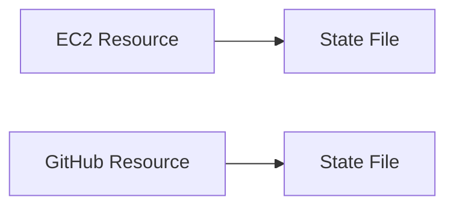

# Terraform State

Main purpose of Terraform state is to store bindings between objects in a remote system and resource instances declared in the configurations.

+ Terraform stores the resource state in a file and each resource is mapped to a state file.
+ Stored locally called `terraform.tfstate`.
    + Can also be store remotely when working in a team environment.
+ Uses this state to create plans and create changes to the infrastructure.
+ Prior to any operations the state within the file is refreshed (`terraform refresh`) to update the state with the real infrastructure (current changes on the infrastructure).
+ Changes made directly upon the infrastructure will be reflected on the state file the next time a terraform opertaion is ran.

+ In case of state file is deleted and resources had been spun up, on another `terraform apply` our GitHub repo doesn't get created as another repository with same name cannot be created, but a new EC2 instance will be created as no unqiue properties are passed by us to create a specific VM.
    + After creation the state file contains Github repo and the most recent EC2 instance. The previously created VM doesn't get affected
    + Which is the reason why state files should not be altered with.
+ If resources are changed from the backend (directly via Azure or AWS) then a `terraform refresh` is required to see the reflect the changes on the resources.

# Desired State
+ The configurations within a `.tf` file are considered to be desired state.
+ When the current state of the backend doesnt meet the desired state, terraform tries to modify the current state to match the desired state.
+ Terraform will only modify the backend resource if the mentioned configurations are out of sync. If changes made to the backend resources are not covered in the configuration files then no modification are necessary, but they still can be seen in the state file once `terraform refresh` has been executed. 
    + For example, in [`ec2.tf`'s line 9](./ec2/ec2.tf#L9) any changes to "instance type" will warrent a modification to the current state if it doesn't match the desired state.
    + But if changes were made to the "security groups" no modificates would be necessary unless [`security_groups`](https://registry.terraform.io/providers/hashicorp/aws/latest/docs/resources/instance#security_groups) had been mentioned in the `ec2.tf` file.
