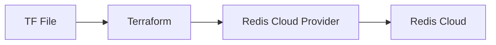

# Provider Versioning
+ Providers release their plugins separately and maintain their versions.

+ It will download the latest version of AWS provider which is greater than `5.0`.
```json
terraform {
  required_providers {
    aws = {
      source = "hashicorp/aws"
      version = "~> 5.0"
    }
  }
}
```
+ Terraform lock file prevents upgrades terraform provider version.
+ Version operators,
  + ">" Greater than, "~>" Greater than but within the same major version number, ">=" greater than or equal to.
  + "<" Less than, "~<" Less than but within the same major version number, "<=" Less than or equal to.
  + `">= 2.20, <= 2.60"` in the example it says to look for version greater than or equal to "2.20" and less than or equal to "2.60".
+ Deleting lock file is one way of modifying the changes to provider version the other is running `terraform init -upgrade`.